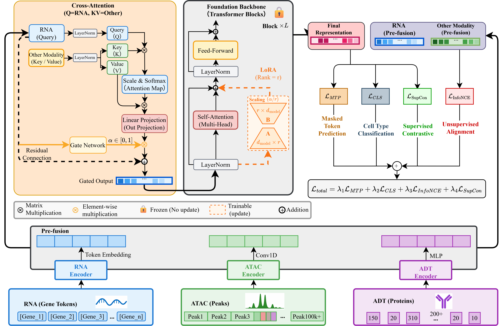

# scMMA: Single-cell Multi-Modal Adapter

[](https://opensource.org/licenses/MIT)
[](https://huggingface.co/)

**scMMA** (Single-cell Multi-Modal Adapter) is a lightweight adapter framework designed to empower pre-trained single-cell RNA foundation models (such as Geneformer and scGPT) to process and integrate multi-modal single-cell data, including scRNA-seq, scATAC-seq, and CITE-seq (ADT).

By utilizing parameter-efficient fine-tuning (PEFT) techniques like LoRA and introducing modality-specific encoders and cross-attention fusion modules, scMMA bridges the modality gap without requiring computationally expensive full-parameter fine-tuning of massive foundation models.

---

## 🌟 Overview & Architecture

Current single-cell foundation models are predominantly pre-trained exclusively on transcriptomic (RNA) data. scMMA solves this limitation by wrapping these models with flexible modality encoders and an advanced fusion module, enabling them to comprehend epigenetic (ATAC) and surface protein (ADT) landscapes.

<p align="center">
  <a href="assets/architecture.png">
    
  </a>
</p>
*Figure 1: Overview of the scMMA framework. RNA tokens are processed by the frozen foundation model (with LoRA adapters). ATAC and ADT data are processed via lightweight modality encoders. The embeddings are then integrated using a Cross-Attention Fusion module before being projected to the final latent space.*

---

## 📂 Repository Structure

```text
scMMA/
├── assets/                  # Architecture diagrams and images
├── baselines/               # Code for baseline methods (GLUE, scECDA, etc.)
├── configs/                 # Hydra configuration files
│   ├── data/                # Dataset-specific configs (multimodal, etc.)
│   ├── model/               # Model architectures and backbone configs
│   ├── train_atac.yaml      # Master config for RNA+ATAC integration
│   ├── train_adt.yaml       # Master config for RNA+ADT integration
│   └── train_trimodal.yaml  # Master config for RNA+ATAC+ADT integration
├── scripts/
│   └── train.py             # Main entry point for training and evaluation
├── src/                     # Core scMMA source code
│   ├── datamodules/         # PyTorch Lightning data modules
│   ├── models/              # Model architectures (encoders, fusion, wrapper)
│   └── utils/               # Metrics and utilities
├── run_all_datasets.sh      # Batch script to run experiments across all datasets
├── run_grid_search.py       # Automated script for hyperparameter search
└── requirements.txt         # Python dependencies
```

> **Note on Data & Models:** Datasets (`.h5ad`), pretrained foundation models, and saved checkpoints are hosted on Hugging Face to keep this repository lightweight.

---

## 🚀 Installation

We strongly recommend using `conda` to manage the environment.

### 1. Create a Conda Environment
```bash
conda create -n scmma python=3.10
conda activate scmma
```

### 2. Install PyTorch
Install PyTorch 2.7.1 (example for CUDA 12.9):
```bash
pip install torch torchvision --index-url https://download.pytorch.org/whl/cu129
```

### 3. Install Dependencies
```bash
pip install -r requirements.txt
```

---

## 💾 Data Preparation

The datasets and pre-trained models required for scMMA are hosted on Hugging Face. You can download them directly into the root directory of this project.

1. **Download Datasets:** Place the `.h5ad` files into the `datasets/h5ad/` directory.
2. **Download Pretrained Models:** Place the foundation model weights (e.g., Geneformer, scGPT) into the `models/pretrained/` directory.

> *Hugging Face Repository Link: [To be added]*

---

## ⚡ Quick Start

scMMA uses **Hydra** for flexible configuration management and **PyTorch Lightning** for distributed training.

### Training RNA + ATAC (e.g., D18 dataset)
```bash
python scripts/train.py --config-name train_atac data.data_dir="datasets/h5ad/D18/RNA+ATAC"
```

### Training RNA + ADT (e.g., D1 dataset)
```bash
python scripts/train.py --config-name train_adt data.data_dir="datasets/h5ad/D1/RNA+ADT"
```

### Automated Batch Execution
To run experiments across all datasets sequentially, you can use the provided shell script:
```bash
bash run_all_datasets.sh
```

---

## 🛠 Configuration System

scMMA leverages [Hydra](https://hydra.cc/) to manage complex configurations hierarchically. The main config files (`train_atac.yaml`, `train_adt.yaml`, `train_trimodal.yaml`) act as entry points.

You can effortlessly override any parameter via the command line. For example, to change the foundation model backbone to scGPT and adjust the learning rate:
```bash
python scripts/train.py --config-name train_atac model/backbone=scgpt model.learning_rate=5e-5
```

---

## 📖 Citation

If you find scMMA useful in your research, please consider citing our paper:

```bibtex
[Citation to be added]
```

---

## 🙏 Acknowledgments

This project builds upon the foundational work of several outstanding open-source projects. We express our gratitude to the authors of:
- **[Geneformer](https://huggingface.co/ctheodoris/Geneformer)**
- **[scGPT](https://github.com/bowang-lab/scGPT)**
- **[PyTorch Lightning](https://lightning.ai/)** & **[Hydra](https://hydra.cc/)**

---

## 📄 License

This project is licensed under the MIT License - see the `LICENSE` file for details.
